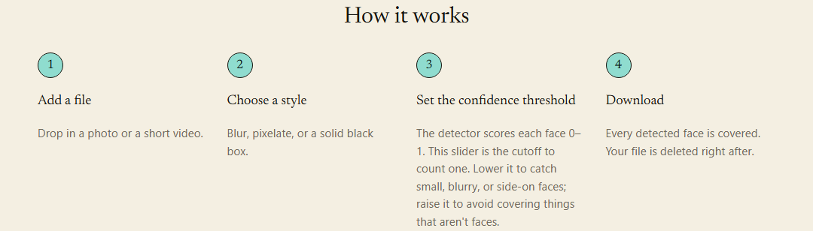
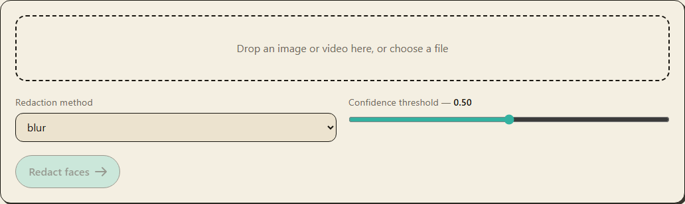

# Obscura

[](https://github.com/ramachandruniml/Obscura/actions/workflows/ci.yml)

Automatic face **detection + redaction** for images and video, so footage can be
shared publicly without exposing bystanders. Blur, pixelate, or black-box every
face; ByteTrack keeps face IDs stable across video frames so the redaction
doesn't flicker and the detector only runs every Nth frame.

**Not** face recognition. No identity matching, no embeddings, no stored frames.
Uploaded files and results auto-delete after a configurable TTL (default 1 hour),
and the worker makes no outbound network calls.

Built in 10 stages — see [Project layout](#project-layout) for the map. All
backend + frontend tests and both Docker image builds pass in
[CI](.github/workflows/ci.yml).

<p align="center">
  
</p>
<p align="center">
  
</p>
<p align="center">
  
</p>

---

## What you need to do to run it

**TL;DR:** install Docker, copy the env file, get **one** set of detector
weights, `docker compose up`.

### 1. Prerequisites

| To run with… | You need |
|---|---|
| **Docker** (recommended) | Docker Desktop / Engine with Compose v2. Ports **3000**, **8000**, **6379** free. |
| **No Docker** | Python **3.11** (not 3.12+), Node **20**, `ffmpeg` on PATH (or rely on the bundled `imageio-ffmpeg`), a local Redis, and [`uv`](https://docs.astral.sh/uv/). |
| **GPU** | NVIDIA Container Toolkit **and** a CUDA torch build in the image (`--build-arg BUILD_TORCH_VARIANT=cu121`). CPU is the default everywhere. |

### 2. Configuration

```bash
cp .env.example .env
```

The defaults work as-is. Every knob is documented in `.env.example` and read by
`backend/app/config.py`.

### 3. Model weights

Not committed. Download them into `backend/weights/` (bind-mounted into the `api`
and `worker` containers). You don't need `uv` for this — any Python works, the
script only uses the stdlib:

```bash
python backend/scripts/fetch_weights.py
```

Both backends auto-download from public mirrors (~8 MB total):

| Backend | Source | Saved as |
|---|---|---|
| YOLOv8-face | `akanametov/yolo-face` GitHub release `1.0.0` | `backend/weights/yolov8n-face.pt` |
| RetinaFace (MobileNet0.25) | `py-feat/retinaface` on HuggingFace | `backend/weights/retinaface_mobilenet0.25.pth` |

If a mirror is down: `--yolov8-url <url>` / `--retinaface-url <url>` /
`--retinaface-gdrive-id <id>` (the last needs `pip install gdown`), or just drop
the file in `backend/weights/` under the name above.

> `backend/app/detectors/_retinaface/` is a trimmed vendoring of biubug6's
> `Pytorch_Retinaface`; it loads and runs against the real MobileNet0.25
> checkpoint (verified end to end — a photo → `n_faces` > 0 → blurred output).
> `DETECTOR_BACKEND=yolov8face` (via Ultralytics) is the alternative if you
> prefer it.

### 4. Run

```bash
docker compose up --build
```

| URL | What |
|---|---|
| <http://localhost:3000> | Frontend (upload → redact → before/after → download) |
| <http://localhost:8000/docs> | API — OpenAPI / Swagger UI |
| <http://localhost:8000/healthz> | Liveness |
| <http://localhost:8000/readyz> | Shows the active detector backend / runtime / device |

GPU:

```bash
docker compose -f docker-compose.yml -f docker-compose.gpu.yml up --build
```

### 5. (Optional) benchmarks + ONNX

Only needed to fill in the [Benchmark results](#benchmark-results) tables.

- **WIDER FACE** — download `WIDER_val.zip` + `wider_face_split.zip` (~1.8 GB)
  from <http://shuoyang1213.me/WIDERFACE/> into `datasets/widerface/`, then
  `cd backend && uv run python scripts/benchmark_widerface.py --data-root ../datasets/widerface`.
- **ONNX latency** — `cd backend && uv run python scripts/export_onnx.py`
  (exports YOLOv8-face, times PyTorch vs ONNX Runtime, writes
  `docs/benchmarks/onnx-latency.md`). To *serve* inference from ONNX, set
  `DETECTOR_RUNTIME=onnx` once `weights/detector.onnx` exists.

---

## Architecture

Five containers, one shared volume. Full write-up in
[docs/architecture.md](docs/architecture.md).

```
                 ┌─────────────┐        ┌──────────────────────────────┐
  browser ─POST /api/redact──▶ │  nginx  │ ──/api──▶ │            api (FastAPI)              │
   (React SPA)  ◀──202 job_id──│ frontend│ ◀───────  │  validate type/size/duration/pixels  │
        │                      └─────────┘           │  write /data/<job>/input.<ext>        │
        │  poll GET /api/jobs/<id>                    │  init manifest.json · enqueue task    │
        │                                             └───────┬──────────────┬───────────────┘
        │                                                     │ Celery       │ reads
        │                                             ┌───────▼──────┐   ┌───▼───────────────┐
        ▼                                             │    redis     │   │  obscura-data vol │
  GET /api/jobs/<id>/result ──▶ (redacted file)       │ broker+result│   │  /data/<job_id>/  │
                                                      └───────┬──────┘   │   input.<ext>     │
                                                              │ dequeue  │   output.<ext>    │
                                              ┌───────────────▼───────┐  │   manifest.json   │
                                              │       worker          │  └───────────────────┘
                                              │  image:  decode → detect → redact → encode
                                              │  video:  demux → (detect every Nth frame +
                                              │          ByteTrack coast) → redact → x264 →
                                              │          ffmpeg audio remux
                                              │  manifest: processing → complete/failed
                                              │  delete input on success
                                              └───────────────────────┘
                                              ┌───────────────────────┐
                                              │   beat  (Celery beat) │  every CLEANUP_INTERVAL_SECONDS:
                                              │                       │  delete /data/<job>/ past manifest.expires_at
                                              └───────────────────────┘
```

**Detector interface** — `app/detectors/base.py` defines `Detection` (xyxy pixel
box + score + optional 5-pt landmarks) and the `Detector` ABC. Implementations —
`RetinaFaceDetector` (vendored biubug6 Pytorch_Retinaface), `YOLOv8FaceDetector`
(Ultralytics), `OnnxFaceDetector` (ONNX Runtime) — are interchangeable; the
registry picks one from `DETECTOR_BACKEND` + `DETECTOR_RUNTIME`.

**Redaction** — `Redactor` ABC + `GaussianBlur` / `Pixelate` / `SolidBox`. Each
expands the box by `BOX_PADDING_RATIO` (more for coasted tracks) before applying
the effect, so edges aren't left exposed.

**Structured logs** — every job binds `job_id` and emits one event per stage:
`upload.received → detection.started → detection.completed (n_faces) →
tracking.completed (n_tracks) → redaction.applied → job.completed`.

---

## API

| Method | Path | Purpose |
|---|---|---|
| `POST` | `/redact` | multipart form: `file` (image or video) + `method` (`blur`\|`pixelate`\|`box`) + `confidence` (0–1). Returns `202 {job_id, status}` and processes in the background. |
| `GET` | `/jobs/{id}` | Job status (`pending`\|`processing`\|`complete`\|`failed`), `stats` (`n_faces`, dimensions, frame counts…), `error`, and `result_url` once complete. |
| `GET` | `/jobs/{id}/result` | The redacted file — images keep their format, video is always `.mp4`. `404` before completion or after the TTL. |

Error codes: `415` unsupported type · `413` too large · `422` corrupt file or
video too long · `400` bad method/confidence · `404` unknown or expired job.

Broker-less single-process mode (handy for a quick local try): set
`CELERY_TASK_ALWAYS_EAGER=true`, `pip install -e "backend[dev]"`, then
`uvicorn app.main:app` — jobs run inline in the request.

---

## Configuration

Full list in `.env.example`. The ones you're most likely to touch:

| Var | Default | Meaning |
|---|---|---|
| `DETECTOR_BACKEND` | `retinaface` | `retinaface` \| `yolov8face` |
| `DETECTOR_RUNTIME` | `pytorch` | `pytorch` \| `onnx` (needs `weights/detector.onnx`) |
| `DEVICE` | `cpu` | `cpu` \| `cuda` |
| `DEFAULT_REDACTION` | `blur` | `blur` \| `pixelate` \| `box` |
| `DEFAULT_CONFIDENCE` | `0.5` | detection score threshold |
| `BOX_PADDING_RATIO` | `0.15` | padding added around every redacted box |
| `DETECT_EVERY_N_FRAMES` | `5` | detector cadence for video; ByteTrack fills the gaps |
| `MAX_UPLOAD_BYTES` | `104857600` | reject uploads larger than this |
| `ALLOWED_IMAGE_TYPES` / `ALLOWED_VIDEO_TYPES` | jpeg/png/webp · mp4/mov/webm | accepted MIME types |
| `MAX_VIDEO_DURATION_SECONDS` | `300` | reject longer videos |
| `RESULT_TTL_SECONDS` | `3600` | auto-delete inputs + outputs after this |

---

## Local dev (without Docker)

```bash
# --- backend ---
cd backend
uv venv && uv pip install ".[dev]"
uv run python scripts/fetch_weights.py                 # weights (see step 3 above)
# start a Redis somewhere, then:
uv run uvicorn app.main:app --reload
uv run celery -A app.worker.celery_app.celery worker -B --loglevel=INFO   # worker + beat

# --- frontend ---
cd frontend
npm ci
npm run dev        # http://localhost:5173, proxies /api -> http://localhost:8000
```

Checks (what CI runs):

```bash
cd backend  && ruff check . && ruff format --check . && pytest -q
cd frontend && npm run lint && npm run typecheck && npm run test && npm run build
```

Tests need **no** model weights or dataset — detection/tracking/redaction/API are
exercised with a `FakeDetector`; weight-gated integration tests skip themselves
when the files are absent.

---

## Project layout

```
obscura/
├── docker-compose.yml            # api + worker + beat + redis + frontend
├── docker-compose.gpu.yml        # NVIDIA override
├── .env.example                  # every adjustable knob
├── backend/
│   ├── app/
│   │   ├── config.py             # pydantic-settings — single source of knobs
│   │   ├── logging.py            # structlog — per-stage structured logs
│   │   ├── errors.py             # ObscuraError hierarchy -> HTTP status
│   │   ├── media.py              # upload classify / size cap / probe
│   │   ├── storage.py            # per-job dir + manifest.json + TTL sweep
│   │   ├── schemas.py            # request/response models
│   │   ├── main.py               # FastAPI app + exception handler
│   │   ├── api/                  # POST /redact, GET /jobs/{id}[/result]
│   │   ├── detectors/            # Detector ABC + RetinaFace + YOLOv8-face + ONNX
│   │   │   └── _retinaface/      # vendored biubug6 model (NOTICE + LICENSE)
│   │   ├── tracking/             # FaceTracker: ByteTrack + coasting
│   │   ├── redaction/            # Redactor ABC + blur / pixelate / box
│   │   ├── pipeline/             # image_pipeline, video_pipeline, runner
│   │   ├── worker/               # celery app, tasks, TTL beat job
│   │   └── benchmarking.py       # WIDER FACE eval + latency helpers
│   ├── scripts/                  # fetch_weights, benchmark_widerface, export_onnx
│   ├── weights/                  # models live here (git-ignored)
│   └── tests/                    # ~180 tests, no weights needed
├── frontend/                     # React + TS + Tailwind + Vite + Vitest
│   └── src/                      # api.ts, hooks/useJobPolling, components/ (CoastScene…), *.test.tsx
├── docs/
│   ├── architecture.md
│   ├── screenshots/              # README images
│   └── benchmarks/               # generated reports (git-ignored)
└── .github/workflows/ci.yml      # backend + frontend + docker jobs
```

---

## Privacy / data retention

- **No** face recognition, identity matching, or embedding storage anywhere in
  the codebase.
- Frames exist only in worker memory for the duration of a job.
- The input file is deleted as soon as a job completes (`DELETE_INPUT_ON_SUCCESS`);
  everything under `/data/<job_id>/` is deleted once `manifest.expires_at` passes
  (`RESULT_TTL_SECONDS`, default 1 h) by the `beat` sweep.
- The worker makes no outbound network calls during processing.

---

## Security posture

This is a local, single-user demo. What's in place:

- **No secrets in the repo** — `.env`, model weights, `/data`, and scratch files
  are git-ignored; CI verifies nothing sensitive is committed.
- **Input is validated before it reaches the worker** — MIME allow-list, a
  streamed size cap (`MAX_UPLOAD_BYTES`), a PIL decompression-bomb guard
  (`MAX_IMAGE_PIXELS`), and a video-duration cap. Bad input → a 4xx, never a
  crash.
- **CORS** is restricted to the configured `CORS_ORIGINS` (never `*`), with no
  credentials and only `GET`/`POST`.
- **nginx** sends `X-Content-Type-Options: nosniff`, `X-Frame-Options: DENY`,
  `Referrer-Policy`, and a locked-down `Permissions-Policy`; `server_tokens` is
  off.
- **Subprocess calls** (ffmpeg) pass an argument list, never a shell string.
- **Dependencies are version-pinned** (`pyproject.toml`, `package-lock.json`);
  CI lints and tests every push.
- **No data retention** — see the section above.

Known limitations for a real deployment: no authentication or rate limiting on
the API, and the containers run as root internally. Add an auth layer, a rate
limiter, and non-root users before exposing this beyond localhost.

---

## Benchmark results

Measured on the full WIDER FACE validation set (3,226 images / 39,112
annotated faces) and the ONNX export, both on a laptop CPU. Full reports with
methodology notes: [widerface.md](docs/benchmarks/widerface.md),
[onnx-latency.md](docs/benchmarks/onnx-latency.md).

### WIDER FACE (validation) — detector comparison

_From `scripts/benchmark_widerface.py`. Metric is a reproducible greedy-IoU
single pass, **not** the official WIDER Easy/Medium/Hard AP — see the report
for why, and for a methodology check (a per-image detection cap was raised and
re-run to confirm it wasn't skewing RetinaFace's numbers — it wasn't, <1 point
of movement)._

| Detector | Backbone | Precision @0.5 | Recall @0.5 | AP | Mean FPS | Median latency (ms) |
|---|---|---|---|---|---|---|
| RetinaFace | MobileNet0.25 | 0.889 | 0.334 | 0.434 | 9.3 | 95.0 |
| YOLOv8-face | n | **0.978** | **0.433** | **0.644** | 5.0 | 129.4 |

Recall by face size (`max(w,h)` px):

| Detector | small (<32) | medium (32–96) | large (>96) |
|---|---|---|---|
| RetinaFace (MobileNet0.25) | 0.374 | 0.924 | 0.980 |
| YOLOv8-face (n) | **0.562** | 0.941 | 0.978 |

**YOLOv8-face is more accurate on every metric here**, most notably on small
faces; **RetinaFace (MobileNet0.25) is faster**, which tracks — it's the
~1.7 MB backbone the upstream authors built for CPU/edge speed, not accuracy.
Recall reads low in absolute terms (33–43%) because it's counting *every*
annotated face, including the extremely dense, few-pixel faces WIDER FACE's
official protocol splits into a separate "Hard" subset; medium/large recall
(92–98% for both) is the more relevant number for this app's use case.

_Hardware: 11th Gen Intel Core i5-1135G7 (CPU only) · Command:
`python scripts/benchmark_widerface.py --data-root <path>`_

### PyTorch vs ONNX Runtime — YOLOv8-face latency

_From `scripts/export_onnx.py` — full report in [docs/benchmarks/onnx-latency.md](docs/benchmarks/onnx-latency.md)._

| Runtime | Mean (ms) | p50 (ms) | p95 (ms) | FPS | Speedup |
|---|---|---|---|---|---|
| PyTorch (YOLOv8-face) | 185.5 | 166.6 | 265.0 | 5.4 | 1.00× |
| ONNX Runtime | 99.9 | 100.2 | 108.0 | 10.0 | **1.86×** |

_100 timed inferences each after warmup; `detector.detect()` (letterbox + forward
+ decode + NMS). CPU — 11th Gen Intel Core i5-1135G7. Command: `python scripts/export_onnx.py`._

---

## Troubleshooting

| Symptom | Cause / fix |
|---|---|
| Every job → `failed`, error mentions "weights not found" | No detector weights in `backend/weights/`. Run `scripts/fetch_weights.py`, or switch `DETECTOR_BACKEND` to the one you have. |
| `docker compose up` → port already in use | Something's on 3000 / 8000 / 6379. Stop it or remap the `ports:` in `docker-compose.yml`. |
| Result looks unchanged | Redaction is applied **per detected face**. A small face → a small (but complete) redacted patch that's easy to miss at full size. Check the job's `n_faces` — if `0`, lower the confidence slider. To cover more area / blur harder, raise `BOX_PADDING_RATIO`, `BLUR_PASSES`, `BLUR_KERNEL_FRACTION` in `.env` then `docker compose up -d worker`. |
| Faces missed | Lower the confidence threshold (small / blurry / side-on faces score low), or try `DETECTOR_BACKEND=yolov8face`. |
| `DEVICE=cuda` but it runs on CPU | The image ships CPU torch. Rebuild with `--build-arg BUILD_TORCH_VARIANT=cu121` and use `docker-compose.gpu.yml`. |
| Video output has no audio | The `ffmpeg` audio remux failed (logged as `video.audio_mux_failed`); the video-only result is still produced. |
| Benchmark script exits with code 2 | WIDER FACE not found at `--data-root`. It's not auto-downloaded — see step 5. |
| Frontend loads but uploads hang | The API/worker isn't reachable. Check `docker compose ps` and `http://localhost:8000/healthz`. |

---

## License / intended use

Built for redacting bystanders in footage you have the right to share. **Not**
for surveillance, identification, or tracking individuals. The vendored
RetinaFace code under `backend/app/detectors/_retinaface/` is MIT-licensed
(see the `NOTICE` and `LICENSE` files there).
